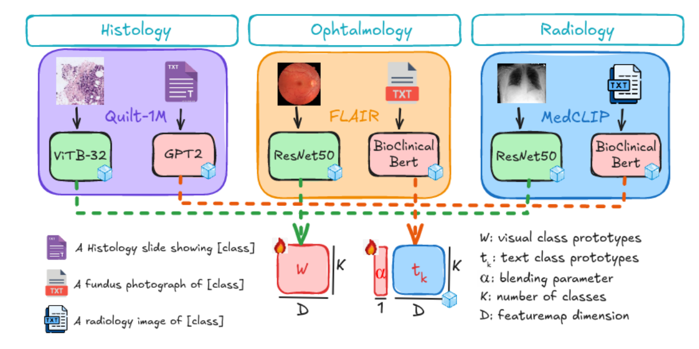

# Few-shot Adaptation of Medical Vision-Language Models - MICCAI 2024 (SpotLight)

## Introduction
The official implementation of the first structured benchmark for adapting medical vision-language models (VLMs) in the few-shot regime. 
We investigate various adaptation strategies commonly used in the context of natural images. 
We evaluate a simple generalization of the linear-probe adaptation baseline, which seeks an optimal blending of the visual prototypes and text embeddings via learnable class-wise multipliers. 

We apply our experiments on three different medical modalities and specialized foundation models. In this repo, we include the code for the three modalities in different sub folders. please check readme of each folder for instructions to run the experiments.

### Visual explanation
<p align="center">
  
  <br>
  <em>Figure 1: Deployment on open-access foundation models. Pre-trained Medical Vision-Language Models: Quilt-1M (histology) , FLAIR (ophthal-
mology), and MedCLIP (X-rays) ..</em>
</p>


## Citations

If you find this repository useful, please consider citing our paper:
```
@article{shakeri2024few,
  title={Few-shot Adaptation of Medical Vision-Language Models},
  author={Shakeri, Fereshteh and Huang, Yunshi and Silva-Rodr{\'\i}guez, Julio and Bahig, Houda and Tang, An and Dolz, Jose and Ayed, Ismail Ben},
  journal={arXiv preprint arXiv:2409.03868},
  year={2024}
}
```

## Contact

For any inquiries, feel free to [create an issue](https://github.com/FereshteShakeri/few-shot-MedVLMs/issues) or contact us at [fereshteh.shakeri.1@etsmtl.net](mailto:fereshteh.shakeri.1@etsmtl.net)